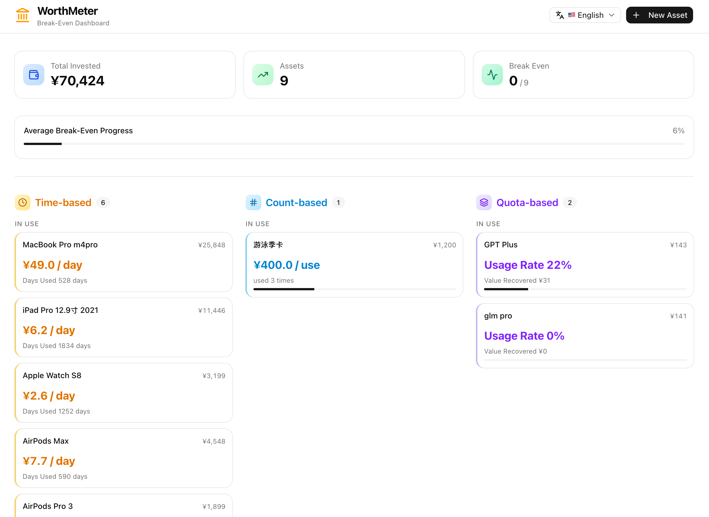

# Worth Meter

A personal asset valuation tracker that helps you monitor and visualize changes in your net worth over time.



## Features

- **Asset Management** — Add, edit, archive, and delete assets across multiple categories
- **Valuation Tracking** — Record value changes over time with date-stamped entries
- **Dashboard Charts** — Visualize portfolio distribution and historical trends
- **Multi-language** — Supports English, 简体中文, 繁體中文, and 日本語
- **Offline-first** — All data stored locally in SQLite, no account required

## Getting Started

```bash
pnpm install
pnpm dev
```

Open http://localhost:3000 in your browser.

## Asset Types

Every asset falls into one of three types, each modeling a different way value depreciates:

### Time-based

Tracks cost recovery purely through the passage of time. No manual logging needed — daily cost decreases automatically every day. You can also set an estimated resale value to reduce the effective cost.

Think: laptops, phones, cameras, headphones.

### Count-based

Tracks cost recovery through discrete, countable uses. You set a target cost-per-use, then log each use. The cost-per-use decreases with every use, and the asset "breaks even" once you've used it enough times.

Think: swimming passes, gym packages, massage cards.

### Quota-based

Tracks how fully you utilize a recurring subscription. You log remaining quota before each billing reset. The system calculates your utilization ratio and estimates how much value you've actually recovered.

Think: GPT Plus, API quotas, cloud storage plans.
